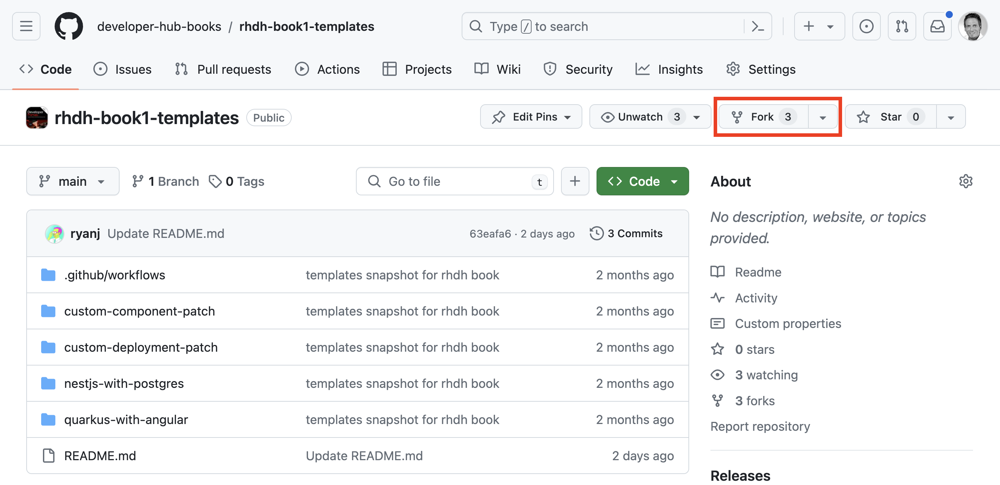
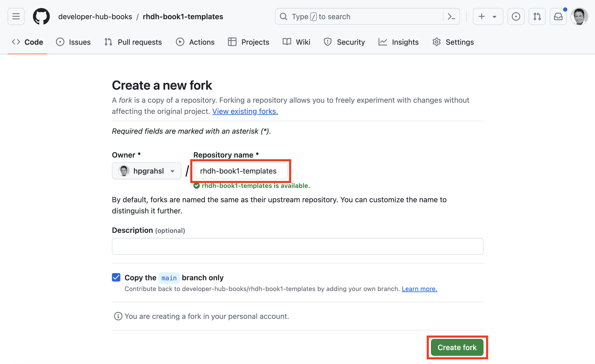
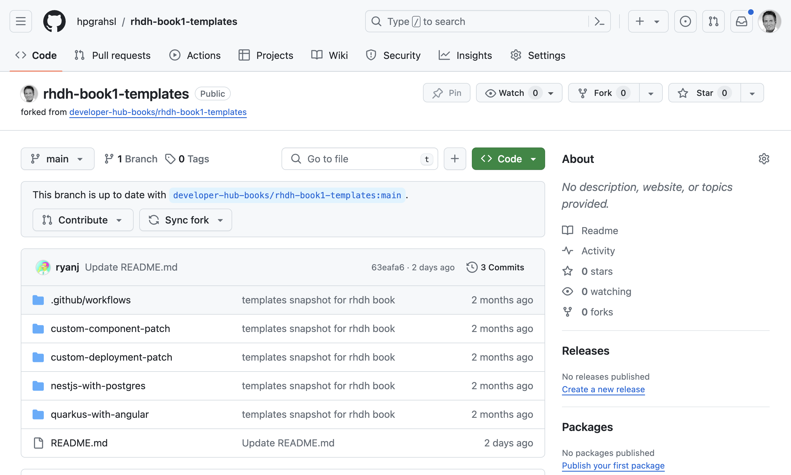
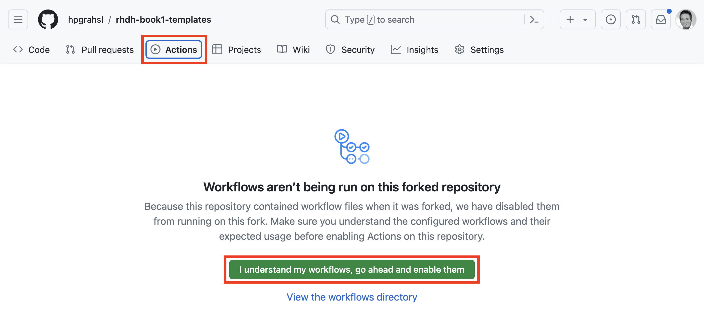
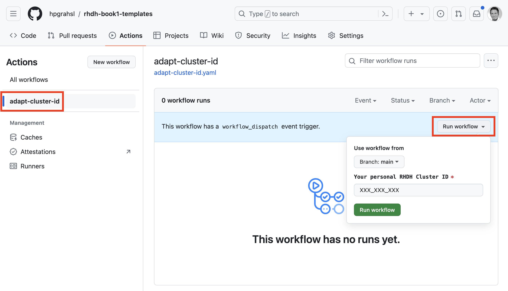
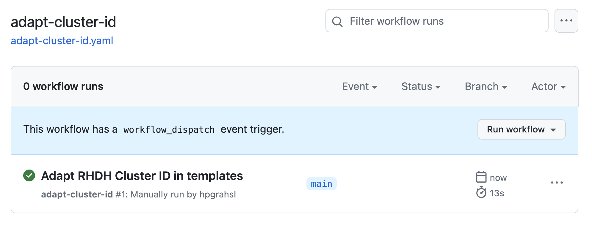
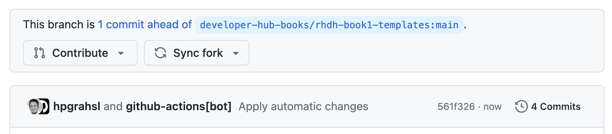
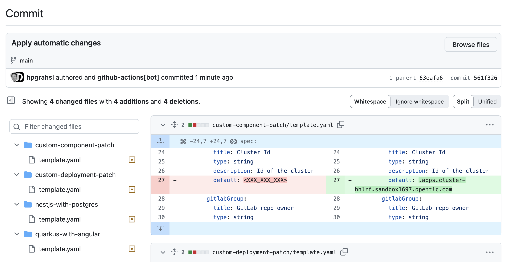

# RHDH Software Templates for the Book "Prepare to Perform"

Instead of directly using this repository for working with the book's example, please create your own fork first. In the forked repository, make the necessary cluster specific changes using the provided GitHub Action before finally adding the templates to your Red Hat Developer Hub instance.

### 1. Create your fork

From the menu bar in the top right choose the **Fork** button.

In the fork dialog choose where (i.e. Owner) your forked repository should be stored and what name it should get. Confirm by clicking the **Create fork** button.

Eventually, you'll end up in the main overview page of your forked repository. 

### 2. Run the Github Action

Choose the Actions tab from the top menu bar. Since this repository contains a workflow file you need to explicitly **enable workflows** in your fork by clicking the corresponding button.

This brings you directly to the Workflow overview page. Choose **adapt-cluster-id** from the left navigation and then click the **Run workflow** drop-down on the far right.

In that dialog, **specify the cluster id** for your RHDH instance. The format varies but it could look like this: *.apps.cluster-hhlrf.sandbox1697.opentlc.com*

Confirm by clicking the **Run workflow** button. This will queue a new workflow run which will get started soon and is expected to finish successfully within just a few moments.

Behind the scences, this workflow run automatically patched the cluster id across all four software templates used in the book's examples. You can see the results as part of a new commit on the main branch in your forked repository.

### 3. Add the software templates

After these preparations, you can proceed with the steps in the book in _"Chapter 3: Templates - Application head start"_ at the section _"Template registration"_.
